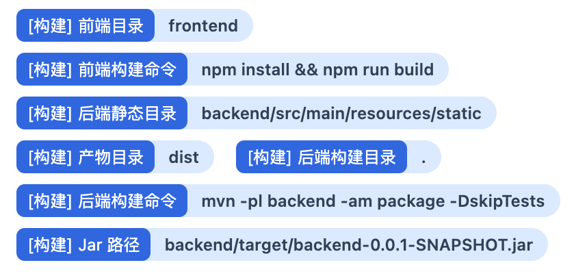

# Deploy Bot 介绍 01：为什么做 Deploy Bot

Deploy Bot 面向的是个人开发者和小团队：项目不少、部署频繁，但还没有必要接入一套很重的商业化交付平台。

很多项目在开发阶段已经被 AI 明显提速了。一个人几天内做出一个可上线的小系统，已经越来越常见。但真正把项目发到服务器上时，常见体验还是不够顺：

- 拉代码、切分支、执行构建命令
- 把产物复制到目标主机
- 停旧进程、启新进程、确认服务是否真的起来
- 出问题后再去翻日志、找 PID、回滚旧版本

这些动作并不复杂，但重复、分散，而且非常依赖经验。一旦项目数量变多、环境变多，或者参与的人不止一个，手工部署很快就会变成负担。

这也是 Deploy Bot 和很多同类平台的差异点：它把范围收敛在个人和小团队最高频的部署链路上，重点关注“把代码稳定发到服务器上”。

## 为什么会需要这样的工具

常见选择大概有三类：

- 商业化 DevOps 平台：能力完整，但对个人和小团队来说价格、接入流程、组织模型和功能复杂度都偏重。
- Jenkins 这类通用 CI/CD 工具：成熟强大，但配置项多，很多概念和插件链路更偏工程平台；默认交互和中文用户的日常部署习惯也不一定贴合。
- 手工脚本：上手最快，但多人协作、历史回看、权限、通知、回滚和服务接管都需要额外补。

Deploy Bot 选择的是更窄的一段：项目、主机、环境、模板、流水线、部署记录和服务进程。它不试图覆盖完整研发管理，而是把部署这条链路做得更顺手。

## 它主要解决什么问题

Deploy Bot 主要解决三类问题：

### 1. 让部署从“靠记忆操作”变成“可配置流程”

很多团队一开始都有一份“部署说明文档”，里面写着：

- 先在哪个目录拉代码
- 用哪个 JDK、哪个 Maven、哪个 Node
- 执行哪条构建命令
- 把哪些文件同步到哪里
- 用什么方式启动服务

这些知识通常都散落在文档、脚本和个人经验里。Deploy Bot 做的事情，就是把这些信息拆成：

- 项目
- 主机
- 运行环境
- 插件
- 模板
- 流水线

这样部署动作不再依赖“谁记得步骤”，而是依赖“系统里已经配置好的流程”。

### 2. 让 Java 服务、前端站点和简单全栈项目都能共用同一套入口

Deploy Bot 面向几类个人和小团队里很常见的部署场景：

- Java Jar 包怎么发
- 前端静态站点怎么发
- 前后端分离项目怎么发
- 一体化项目怎么发

平台通过插件、模板和变量描述不同项目的部署方式，日常使用时统一从流水线发起部署。

部署类型由插件承载。Spring Boot、Node 静态站点、前后端一体项目各自通过插件声明自己的运行时要求、默认模板、运行配置、PID 发现和启动判定。后面如果要支持 Docker、Python、Go，也可以沿用同一套插件扩展方式。

### 3. 让部署后的排查也留在同一个系统里

很多时候，真正耗时间的不是“点部署”，而是：

- 这次到底发了哪个分支
- 用了哪些变量
- 插件运行配置是什么
- 和上一次成功部署相比改了哪些 commit
- 为什么启动失败
- 老进程 PID 是多少
- 当前接管的是哪个新 PID
- 上一次成功版本还能不能重新发

Deploy Bot 不只是发起部署，还会留下部署记录、部署快照、部署差异、SSE 实时日志、服务状态和 PID 变化轨迹。这样当问题出现时，至少信息还在一个地方，不需要再去手工拼现场。

## 为什么它适合先把自己部署上去

Deploy Bot 还有一个很实用的特点：它很适合作为“第一个被接管的项目”。

也就是说，你可以先在本地把 Deploy Bot 跑起来，用它把自己部署到云端服务器上。等这套平台先稳定运行在云端之后，后面其他项目的部署、回滚、查看日志、服务接管、通知记录，就都可以直接在这套云端平台里完成。

这条路径的好处很直接：

- 本地先完成一次配置和验证
- 云端上线后就有了固定的部署入口
- 后面不需要继续依赖本地机器来发其他项目
- 平台本身也能作为模板、流水线和主机配置的真实演示项目

对于 Deploy Bot 自己这类前后端一体项目，常见做法通常是：

- 前端在 `frontend` 目录构建
- 前端产物输出到 `dist`
- 把 `dist` 合并到 `backend/src/main/resources/static`
- 后端在 `backend` 目录执行 `mvn -DskipTests package`
- 最终发布后端 Jar 并在云端启动

下面这张图就是一条典型的自部署流水线配置示例：

这样做完之后，Deploy Bot 就从“本地一个开发中的系统”，变成了“云端一个可持续接管其他项目的部署平台”。

## 这个项目的取舍是什么

Deploy Bot 更偏向下面这些取舍：

- 优先支持最常见的部署路径，而不是所有复杂场景
- 优先把配置和执行跑通，而不是先做厚重的平台能力
- 优先让一个人或小团队能快速上手，而不是先覆盖复杂组织架构
- 优先保留现场信息，方便排查，而不是只关心“触发成功”
- 优先做中文语境下更直接的界面和交互，而不是照搬通用 CI/CD 工具的配置体验

这也是为什么项目里会把重点放在：

- 模板与流水线
- 插件化部署类型
- 本机构建 + 远程发布
- 服务进程接管
- 部署快照与部署差异
- 实时日志与日志目录
- 通知与记录

这些真实高频场景上。

## 适合什么人

Deploy Bot 更适合这些场景：

- 个人开发者，想把多个项目统一上线
- 小团队，希望把重复部署动作收敛到一个轻量系统里
- 以 Java 服务、前端站点、简单全栈项目为主的交付场景
- 不想一开始就引入重型交付平台，但又不想永远靠手工脚本

如果你的团队已经有很成熟的 CI/CD 平台，Deploy Bot 不一定是替代品；但如果你正处在“项目不少、部署不少、流程却还很散”的阶段，它会更有价值。

## 如果后面接入 AI skill，会更适合小团队起服务

Deploy Bot 的结构天然适合继续往 AI 辅助接入方向走。因为平台里的关键对象已经比较清楚：项目、主机、运行环境、插件、模板、流水线、部署记录。

后续可以考虑提供一套面向 AI 的 skill，让 AI 读取这些上下文后，按平台约定完成一些重复但容易出错的接入动作：

- 根据 Git 仓库识别项目结构和技术栈，推荐合适的插件模板
- 帮用户创建项目、流水线，并补齐目标主机、运行环境、运行配置和默认变量
- 在默认模板不够用时，辅助创建派生模板，抽取变量并生成说明
- 遇到新的部署类型时，按插件规范快速生成插件骨架，再由开发者补充具体脚本和判活逻辑

这样 Deploy Bot 就不只是“点按钮部署”，而是更像一个小团队的轻量上线入口：新服务来了，先让 AI 把接入草稿搭起来，人再确认关键路径和敏感配置。对个人开发者和小团队来说，这会比从零配置一套重型平台更贴近日常节奏。

## 接下来怎么看这套系统

理解了“为什么做”，后面再去看具体菜单和配置就会顺很多。后续内容会按真正的使用顺序展开：

1. 项目怎么配置
2. 主机怎么连通
3. 运行环境怎么准备
4. 插件和模板怎么抽象
5. 流水线怎么拼成完整部署流程
6. 部署后怎么查看记录、日志、差异、服务与通知
