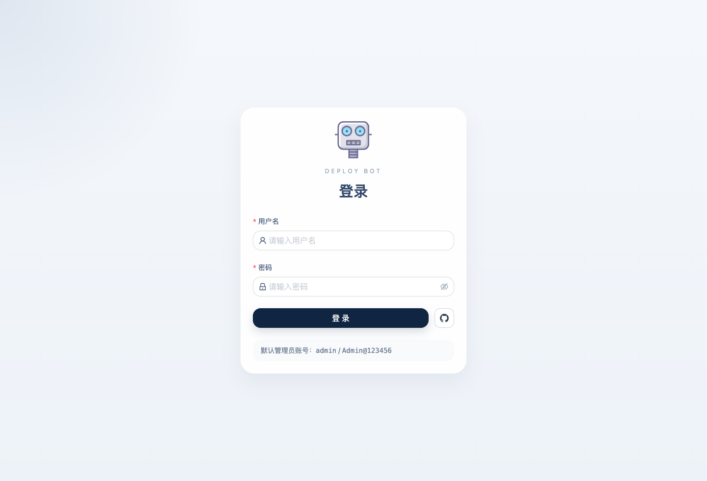
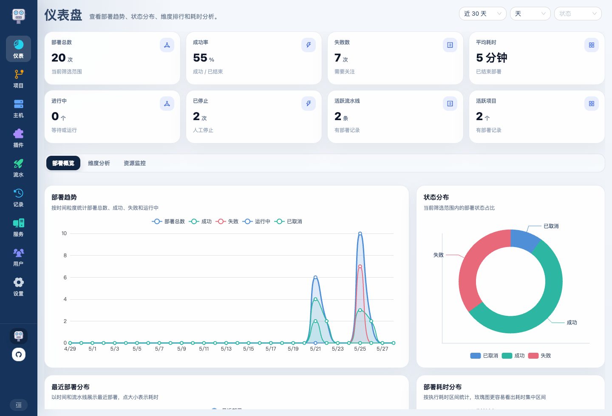
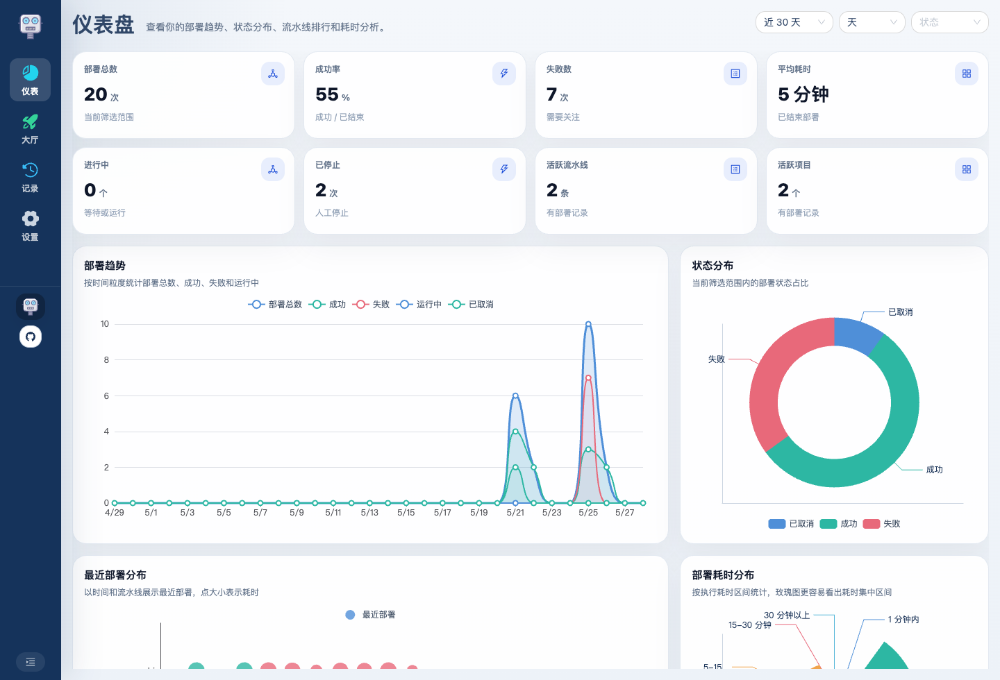

# Deploy Bot 使用介绍 02：登录、仪表盘与统一工作台

第一次进入系统时，先把登录入口、仪表盘和菜单分工看清楚，后面的配置和部署会顺很多。Deploy Bot 现在是一套统一工作台，按账号权限展示不同菜单、数据范围和操作能力。

## 1. 登录页

进入系统后，先看到的是统一登录页：

登录成功后，系统会根据当前账号权限展示不同能力：

- 管理员可以看到项目、主机、环境、插件、模板、流水线、服务、用户和系统设置等配置能力
- 普通用户只看到部署所需入口、部署记录，以及自己的 UI 设置

也就是说，页面形态尽量统一，差异主要来自权限：管理员看到全局数据和配置入口，普通用户看到自己能部署、能排查、能设置 UI 的部分。

## 2. 仪表盘主要看数据和图表

仪表盘更偏总览，适合先看当前整体情况：

仪表盘主要用图表表达：

- 部署趋势
- 状态分布
- 耗时分布
- 流水线、项目、模板等维度排行
- 最近部署变化
- 主机资源概览（管理员可见）

时间范围和粒度可以切换，适合快速判断最近一段时间到底是部署变多了、失败变多了，还是某些流水线耗时异常。

## 3. 普通用户看到什么

普通用户不需要维护平台配置，所以菜单会更轻：

普通用户重点关注：

- 流水线大厅
- 部署记录
- 部署详情
- 自己的 UI 设置

管理员和普通用户使用的是同一套工作台思路，只是数据范围和可用操作不同。管理员看到全局数据，普通用户看到适合自己执行部署和排查问题的数据。

## 4. 左侧菜单、顶部菜单和主题设置

系统设置里提供了 UI 设置：

- 菜单布局：左侧菜单或顶部菜单
- 左侧菜单是否折叠
- 图标样式：实心或双色线性
- 主题：浅色、深色、跟随系统
- 是否夜间自动开启深色模式

如果本地没有保存过配置，默认会使用左侧折叠菜单，并开启跟随系统和自动深色。

浅色模式更适合日间操作，深色模式更适合夜间排查和长时间查看日志；如果开启跟随系统或夜间自动深色，平台会根据本机偏好自动切换。

## 5. 菜单怎么理解

菜单可以按使用频率分成三类。管理员会看到完整菜单，普通用户只看到日常部署和个人设置相关入口。

### 日常部署

- 仪表盘
- 流水线大厅
- 部署记录
- 服务管理

### 平台配置

- 项目管理
- 主机管理
- 运行环境
- 插件管理
- 模板管理
- 流水线管理

### 平台维护

- 用户管理
- 系统设置

其中只有流水线页面比较特殊：它同时有“大厅”和“管理”两种视角。大厅用于快速部署，管理用于维护流水线配置；普通用户只需要大厅能力，管理员可以切到管理能力。

## 6. 先理解菜单结构，再开始配置

如果是第一次使用，建议先按这个顺序理解页面：

1. 配置基础资源：项目、主机、运行环境、插件、模板、流水线
2. 日常部署排查：流水线大厅、部署记录、部署详情
3. 运维补充能力：服务管理、通知记录、系统设置

把登录入口、菜单布局和权限差异看清以后，再进入后面的配置章节，会更容易把整套系统串起来。
