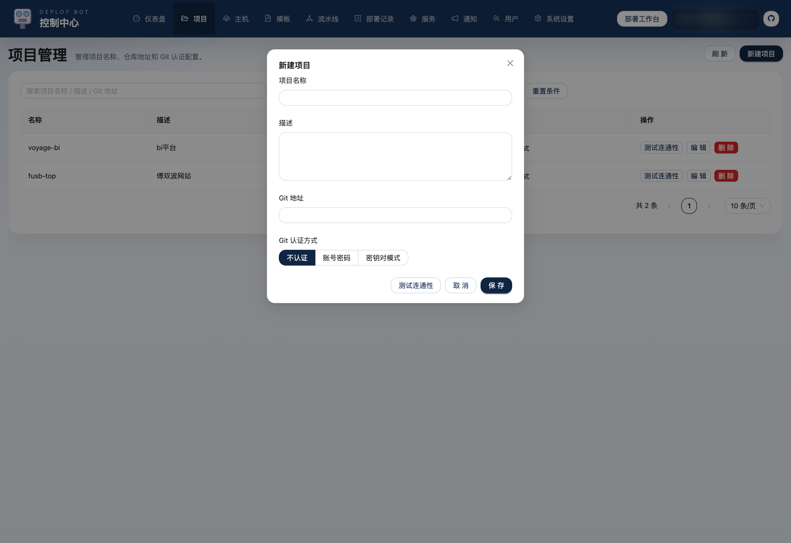
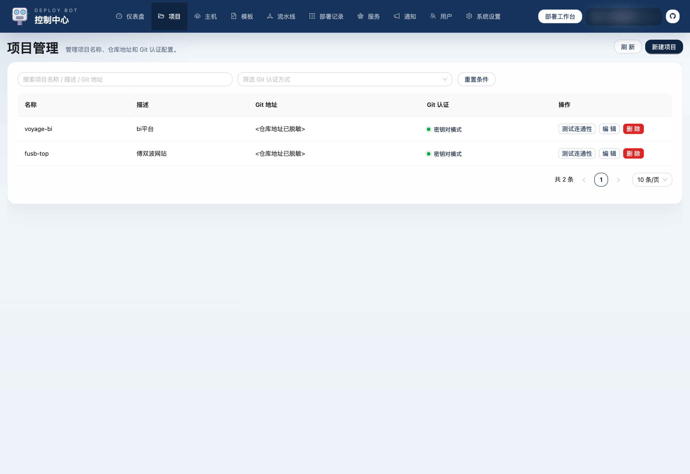

# Deploy Bot 使用介绍 03：项目怎么配置

这一篇只讲项目管理，而且只讲“怎么把一个仓库配置到能真正连通”的过程。  
项目页不是随便填几行文本，它决定了后面流水线到底能不能把代码拉下来。

## 1. 项目页管的到底是什么

项目页维护的是“代码仓库本身”：

这里不负责：

- 目标主机
- 启动命令
- 部署目录
- 运行环境

它只负责回答两件事：

1. 仓库地址是什么
2. 平台以后用什么方式访问这个仓库

## 2. Git 认证方式有哪些

项目页里实际支持 3 种认证方式，不是一句“最常见是 SSH”就能带过：

### 1. `NONE`

也就是“不认证”。

适合：

- 公开仓库
- 公司内网里无需额外认证的只读仓库

这时平台只需要拿仓库地址直接拉代码。

### 2. `BASIC`

也就是“账号密码模式”。

适合：

- HTTP / HTTPS 仓库地址
- 需要用户名、密码或 token 的仓库

代码里这里有一个明确限制：  
账号密码模式只能保存和测试 `http://` / `https://` 仓库地址。

### 3. `SSH`

也就是“密钥对模式”。

适合：

- `git@...` 形式地址
- `ssh://...` 形式地址
- 需要通过 SSH 密钥拉代码的仓库

代码里这里也有明确限制：  
密钥对模式只能保存和测试 SSH 仓库地址。

## 3. 新建项目怎么填

点击右上角按钮后，会打开项目配置弹窗：

建议按这个顺序填：

### 1. 项目名称

这个名称会在：

- 流水线列表
- 部署记录
- 部署详情

里频繁出现，所以尽量直接、稳定，不要今天叫 A 明天叫 B。

### 2. 描述

描述建议写业务含义或仓库职责，例如：

- 管理后台前端
- 官网站点
- 用户服务后端

不要只是重复一遍项目名。

### 3. Git 地址

这一项要和认证方式对应起来：

- `NONE / BASIC`
  优先用 `http://` 或 `https://`
- `SSH`
  用 `git@...` 或 `ssh://...`

前端代码里还有一层辅助逻辑：  
如果你把认证方式切到 `SSH`，而当前填的是 HTTP 地址，页面会尝试自动把地址转成 SSH 形式，并提示你确认地址是否正确。

### 4. Git 认证方式

这里不要凭感觉选，直接按你的仓库接入方式来：

- 公开仓库：`不认证`
- HTTP + 用户名/密码或 token：`账号密码`
- SSH 私钥拉取：`密钥对模式`

## 4. 密钥对模式到底用哪套密钥

这是项目配置里一个很重要、但很容易被忽略的点。

项目选择 `密钥对模式` 后，并不是在项目弹窗里单独贴一份私钥。  
它会统一使用系统设置里的 **Git SSH 密钥对**。

也就是说，正确顺序应该是：

1. 先到系统设置生成 `Git SSH 密钥对`
2. 把系统生成的 Git 公钥加到对应 Git 平台
3. 回到项目页把认证方式选成 `密钥对模式`
4. 再测试仓库连通性

这样所有走 SSH 的项目都能共用同一套 Git 密钥，维护成本会低很多。

## 5. 测试连通性不是可有可无

项目弹窗和项目列表里都提供了 `测试连通性`：

- 表单里测：适合你还没保存，先验证这次填写是否正确
- 列表里测：适合项目已经保存，后面想再次确认

测试成功后，页面会弹出明确结果，包括：

- 认证方式
- 仓库地址
- 连通性输出

所以推荐的实际操作顺序是：

1. 填项目
2. 点 `测试连通性`
3. 看到成功结果
4. 再保存

这样能把很多问题在最前面挡掉，而不是等到第一次部署时才发现拉代码失败。

## 6. 不同认证方式各自怎么配

### 不认证

最简单：

1. 填仓库地址
2. 认证方式选 `不认证`
3. 测试连通性
4. 保存

### 账号密码

推荐顺序：

1. 填 `https://...` 仓库地址
2. 认证方式选 `账号密码`
3. 填用户名
4. 填密码或 token
5. 点 `测试连通性`
6. 成功后保存

### 密钥对模式

推荐顺序：

1. 先去系统设置生成 Git SSH 密钥对
2. 把 Git 公钥加到代码托管平台
3. 回到项目页填 `git@...` 或 `ssh://...` 仓库地址
4. 认证方式选 `密钥对模式`
5. 点 `测试连通性`
6. 成功后保存

## 7. 编辑项目时一般改什么

已有项目最常改的是：

- 仓库地址变了
- 认证方式变了
- 仓库 token 变了
- 项目说明要更新

这些都可以直接在编辑弹窗里改：

每次改完后，也建议顺手再点一次 `测试连通性`，不要只保存不验证。

## 8. 项目层不要塞环境差异

项目层不要放这些内容：

- 哪台主机发版
- Java / Node / Maven 版本
- 部署目录
- 启动命令
- Profile

这些都不是“仓库本身”的信息，应该放到主机、运行环境、模板或流水线里。

## 9. 项目这一层配错最容易导致什么问题

如果项目层配错，最直接的结果一般是：

- 拉代码失败
- 认证失败
- 仓库地址和认证方式不匹配
- 流水线到了第一步就卡住

所以项目页虽然字段不算多，但它是整条部署链路的起点。

项目配置完成后，下一步就是把目标主机接入平台，并确保测试连接可以成功通过。
