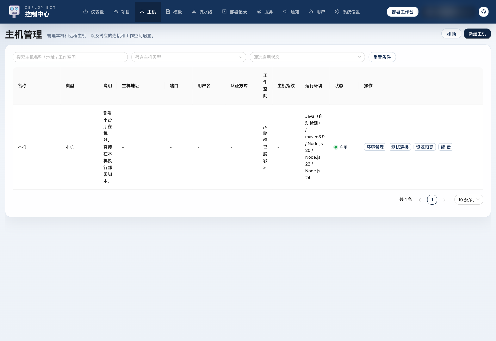
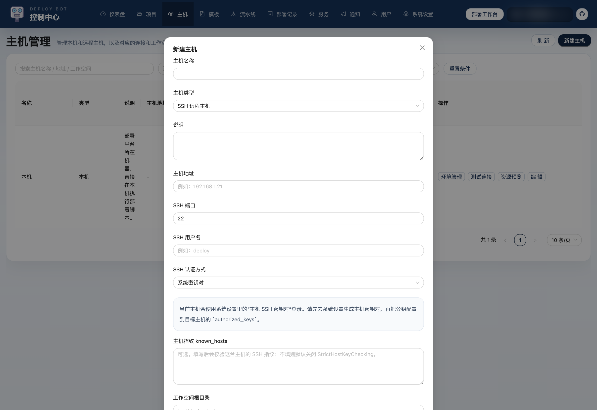
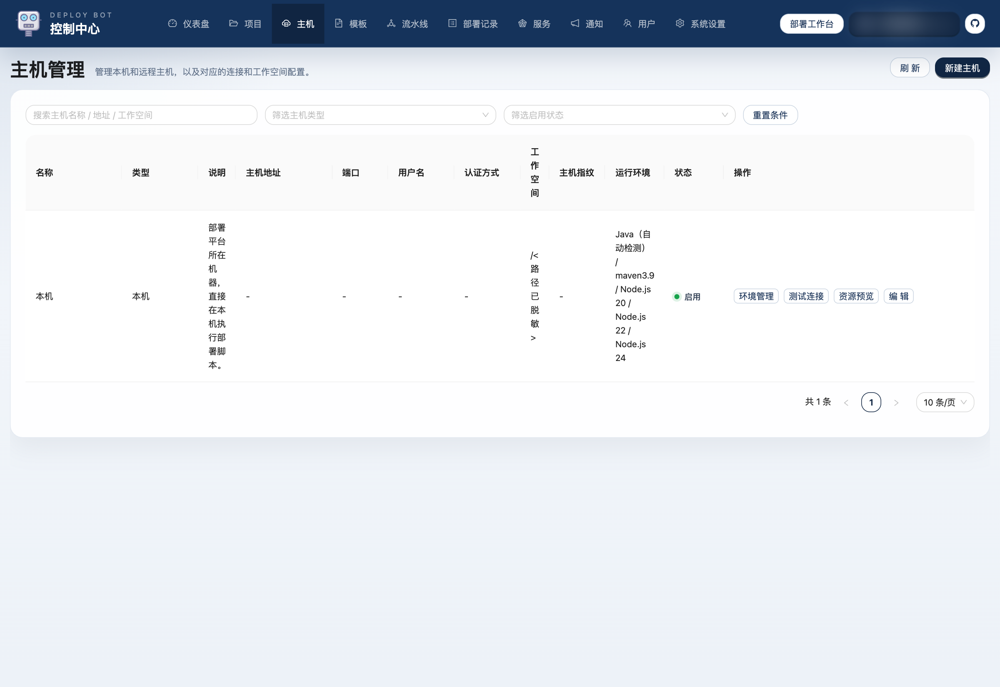

# Deploy Bot 使用介绍 04：主机怎么配置

项目解决的是“代码从哪里来”，主机解决的是“产物发到哪里去、脚本在哪里执行、平台怎么连上那台机器”。

这一篇会把下面这几件事串起来讲清楚：

- 主机页字段怎么填
- 主机 SSH 认证方式有哪些
- 系统设置里的 `主机 SSH 密钥对` 怎么配
- `known_hosts` 怎么理解
- `测试连接` 为什么一定要先过

## 1. 主机页的作用

主机页负责维护部署目标：

这里管理的不只是远程机器，也包括本机。

在 Deploy Bot 里，本机不是特殊写死的概念，而是一条正式的主机记录。  
这样后面的工作空间、运行环境、构建产物目录都能统一处理。

## 2. 主机页支持哪些类型

当前可新增的主机类型主要是：

- `SSH 远程主机`

而 `本机` 通常是系统自动内置的一条记录，不需要你自己手工再建一遍。

## 3. SSH 认证方式有哪些

主机配置里，SSH 认证方式当前支持 3 种：

### 1. 密码

也就是直接填 SSH 密码。

适合：

- 临时测试
- 机器本身就是密码登录

### 2. 私钥

也就是在主机弹窗里直接填这台主机专属私钥。

适合：

- 这台主机需要一套单独的 SSH 私钥
- 你不想复用平台统一主机密钥

### 3. 系统密钥对

这是更适合长期维护的一种方式。

它的意思不是在主机页里单独贴私钥，而是：

- 主机登录统一使用系统设置里的 `主机 SSH 密钥对`

这样所有选择“系统密钥对”的主机，都复用同一套平台级主机 SSH 密钥。

## 4. 新建主机怎么填

点击右上角按钮后，会进入主机表单：

建议按这个顺序理解字段：

### 1. 主机名称

建议直接写人能看懂的名字，例如：

- 构建机
- 线上应用机 1
- 官网静态资源机

不要只写一个 IP，当主机一多后会很难分辨。

### 2. 主机地址 / SSH 端口 / 用户名

这 3 个就是平台之后 SSH 登录这台机器时真正会用到的连接信息。

### 3. SSH 认证方式

这里一定要和你的实际接入方式匹配：

- 机器平时用密码登录：选 `密码`
- 机器有独立私钥：选 `私钥`
- 想复用平台统一主机密钥：选 `系统密钥对`

### 4. 工作空间目录

这个目录非常关键。

平台后面会在这里放：

- runs 工作目录
- artifacts 构建产物
- logs 日志
- downloads 预置安装包
- tools 预置环境目录

所以这个目录最好单独给 Deploy Bot 预留一块干净空间，不要混到业务目录里。

### 5. 主机指纹 `known_hosts`

这是可选项，但不是没意义。

它的作用是：

- 校验你连的是不是正确的那台 SSH 主机
- 避免连到被冒充的主机

如果你希望严格校验远程主机身份，就把目标主机的 SSH 指纹填到这里。  
如果你当前只是先接入验证，也可以先不填，但更稳的方式还是配上。

## 5. 系统设置里的“主机 SSH 密钥对”怎么配

如果你准备让主机使用 `系统密钥对` 登录，这一步必须先做。

系统设置里有专门的主机 SSH 区域：

正确顺序是：

1. 到系统设置生成 `主机 SSH 密钥对`
2. 复制系统生成的主机公钥
3. 把这把公钥添加到目标主机的 `~/.ssh/authorized_keys`
4. 回到主机页，把认证方式选成 `系统密钥对`
5. 再点 `测试连接`

## 6. 平台已经给了快捷脚本，怎么用

系统设置里其实还给了一个快捷脚本入口，用来把公钥追加到目标主机的 `authorized_keys`。

它做的事本质上就是：

- 自动创建 `~/.ssh`
- 自动设置权限
- 把当前平台生成的主机公钥追加进 `authorized_keys`

所以如果你不想手工一行一行敲，可以直接在目标主机上执行那段脚本。

## 7. 测试连接到底测的是什么

主机列表里有单独的 `测试连接` 按钮，这一步不要省。

测试成功后，页面会弹出：

- 远程用户
- 远程主机
- 工作空间目录
- 返回说明

也就是说，这不是只测 SSH 能不能连通，它还顺手验证了：

- 登录是否成功
- 当前认证方式是否正确
- 工作空间目录是不是可访问

所以更推荐的实际顺序是：

1. 先填主机
2. 点 `测试连接`
3. 看到成功结果
4. 再保存或继续后续配置

## 8. 编辑主机时一般改什么

主机建好之后，最常改的是：

- 地址变了
- 用户名变了
- SSH 认证方式变了
- 工作空间目录要调整
- `known_hosts` 要补充

这些都可以直接在编辑弹窗里维护：

## 9. 哪些主机适合复用平台主机密钥

如果你有多台都由同一套部署平台统一管理的机器，通常就适合：

- 都用 `系统密钥对`

优点是：

- 不用每台主机都单独贴私钥
- 后面维护简单

但如果某台机器就是必须用自己独立私钥，那就单独选 `私钥` 模式，不要硬套统一方案。

## 10. 主机配置完成的标准是什么

不是“表单保存成功”就算完成，而是至少满足这几个条件：

1. 认证方式和实际接入方式一致
2. 工作空间目录合理
3. 如果走系统密钥对，公钥已经加到目标主机 `authorized_keys`
4. `测试连接` 成功

做到这一步，后面的运行环境、模板、流水线才是建立在一个真正可用的主机基础上。

主机接入完成后，就可以继续为这台主机准备 Java、Node、Maven 等运行环境。
