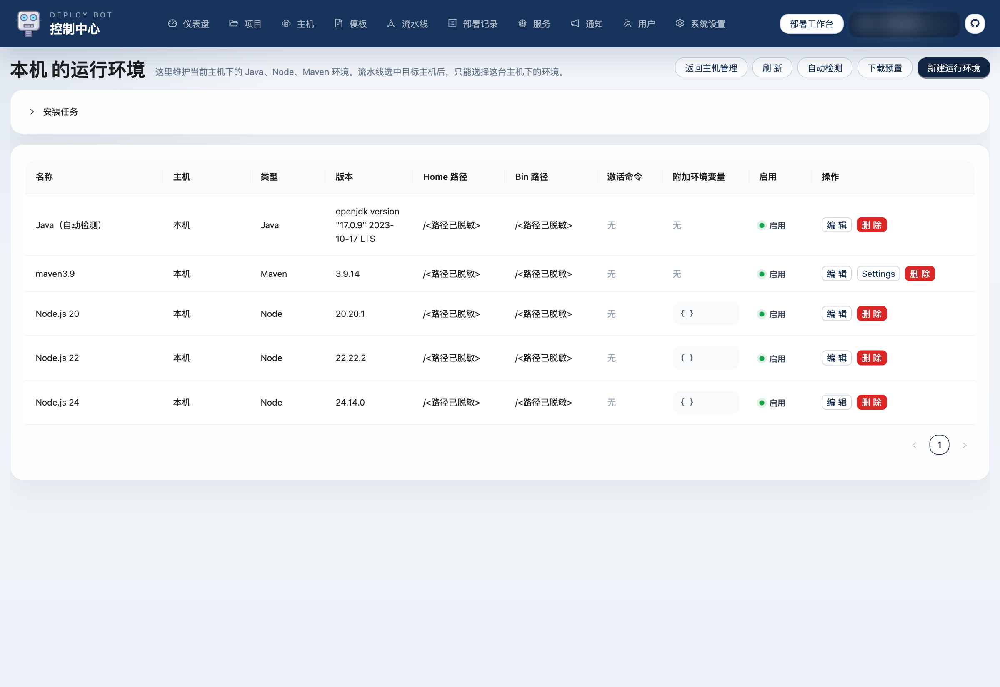
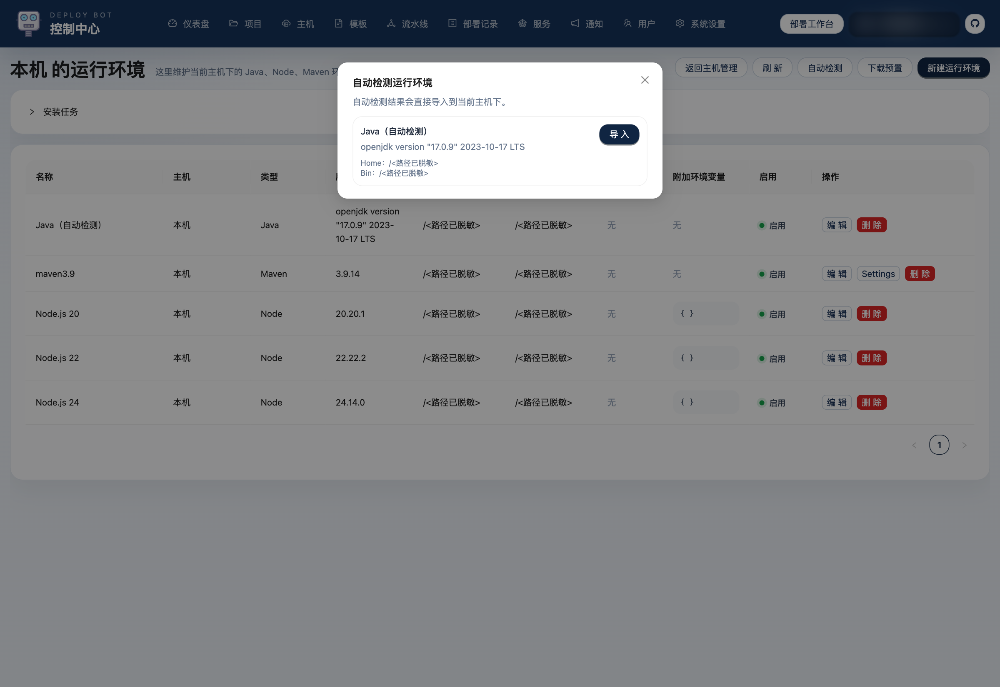
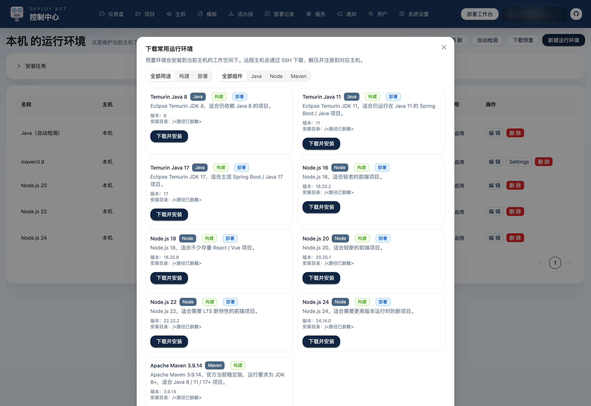

# Deploy Bot 使用介绍 05：运行环境怎么配置

主机配好之后，下一步不是马上建流水线，而是先把运行环境整理好。  
运行环境决定了平台后面拿什么 Java、Node、Maven 去构建和运行。

这一篇重点讲 4 件事：

- 手动新建环境怎么填
- 自动检测什么时候用
- 下载预置什么时候用
- Maven settings.xml 应该放在哪一层

## 1. 运行环境页是什么

主机列表里的“环境管理”会进入运行环境二级页：

这里按主机维护三类环境：

- Java
- Node.js
- Maven

也就是说，运行环境不是全局一份，而是归属到具体主机。

## 2. 新建运行环境适合什么场景

如果你已经知道目标环境路径，最直接的方式就是手动新建：

- Java home / bin 已知
- Node 路径已知
- Maven 路径已知

这种方式适合：

- 已经装好了环境
- 想显式指定某个固定版本
- 平台只负责登记，不负责下载

这类环境记录里，最值得认真填的是：

- `名称`
- `类型`
- `版本`
- `homePath`
- `binPath`
- `activationScript`
- `environmentVariables`

尤其是 `binPath` 和 `activationScript`，会直接影响后面平台到底能不能正确调用这个环境。

## 3. 自动检测适合什么场景

如果这台主机上已经装过 Java / Node / Maven，但你不想手动抄路径，可以先点自动检测：

它更适合：

- 机器上已有环境
- 想快速导入
- 想先看看平台能识别到哪些可用版本

检测结果导入后，仍然会变成平台里的正式运行环境记录。

## 4. 下载预置适合什么场景

如果目标环境还没装，也可以直接用平台下载预置版本：

这类方式适合：

- 新机器初始化
- 想统一版本
- 不想手动进服务器下安装包

现在常见的 Java / Node / Maven 版本都可以直接走这个入口安装。

## 5. Maven 的 settings.xml 怎么管理

Maven 比 Java / Node 多一层 settings.xml 配置，所以平台在 Maven 环境下还提供了单独的 settings.xml 管理：

这里适合处理：

- 内网仓库地址
- 私服认证
- 不同环境下的镜像源差异

如果你的 Maven 构建依赖内部仓库，这一层就很重要。  
后面流水线里选中某个 Maven settings 后，平台构建时会自动给 `mvn` 注入对应的 `-s`。

## 6. 三种方式到底怎么选

可以按下面这个方式快速判断：

### 机器上已经装好了，而且你知道路径

直接手动新建。

### 机器上已经装好了，但你不想手抄路径

先自动检测，再导入。

### 机器上还没装，想统一版本

直接下载预置。

### Maven 还依赖私服或特殊镜像

Maven 环境建好后，再单独补 settings.xml。

## 7. 运行环境到底分“构建”和“运行”两类吗

在实际使用里，是的。

比较常见的组合是：

- `Node`
  用于本机构建前端
- `Maven`
  用于本机构建后端
- `Java`
  既可能用于本机构建，也可能用于目标主机运行服务

所以环境页虽然看起来只是登记版本，实际上是在给后面的模板和流水线准备“可选资源池”。

## 8. 推荐的使用顺序

一台新主机进来时，我更建议按这个顺序走：

1. 先确认工作空间目录
2. 自动检测已有环境
3. 不够的部分再下载预置
4. Maven 如有私服需求，再补 settings.xml

这样后面建流水线时，基本不会再被“环境还没准备好”打断。

运行环境准备好以后，就可以开始设计模板，把构建脚本、发布脚本和变量整理成可复用的部署方法。
