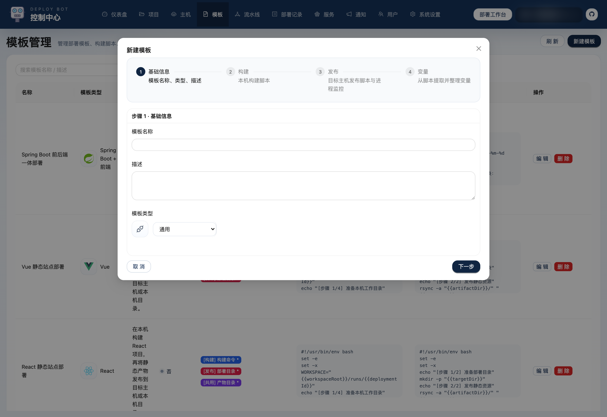
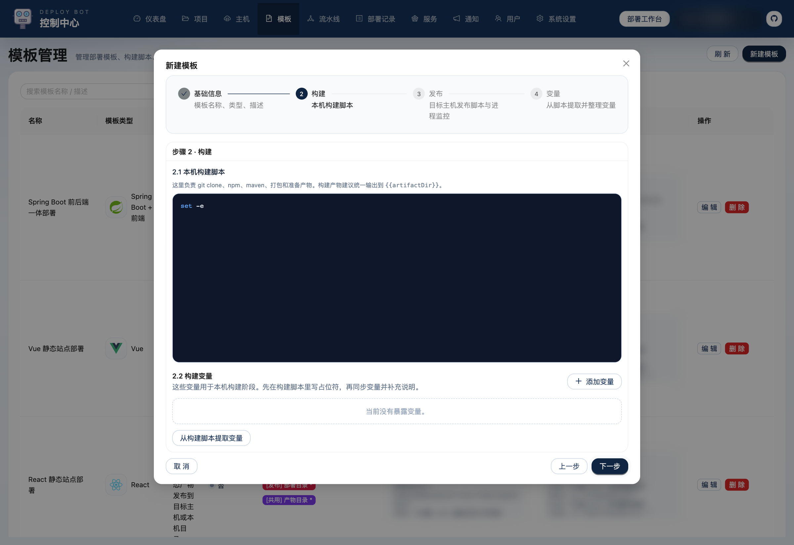
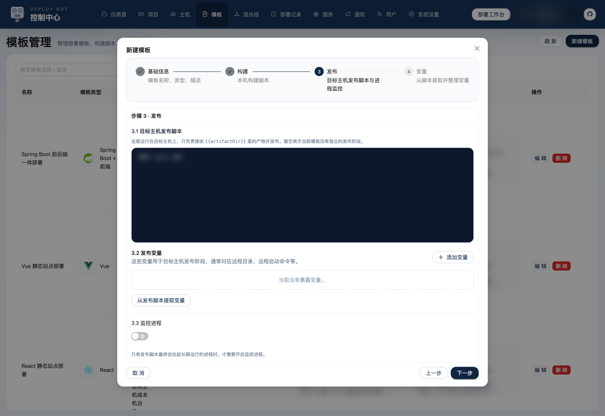
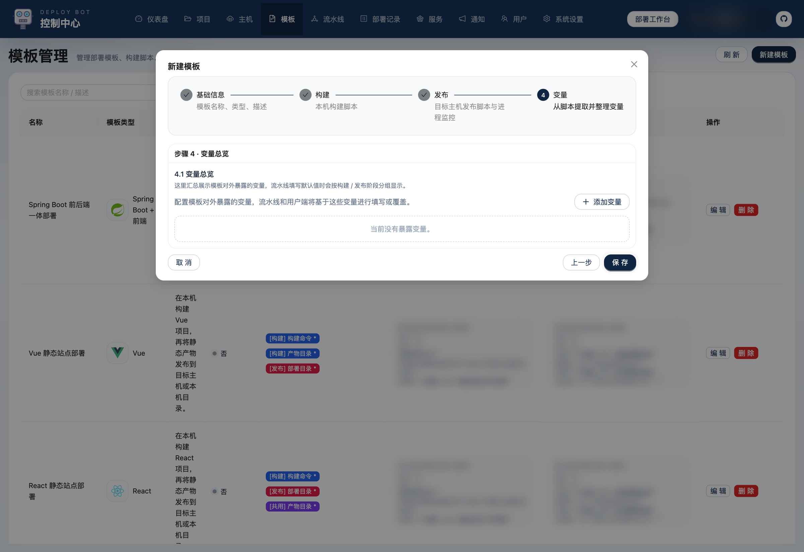

# Deploy Bot 使用介绍 06：模板怎么设计

模板是这个项目很核心的一层。  
主机和环境解决的是“资源准备好没有”，模板解决的是“这一类项目到底怎么构建、怎么发布、变量暴露给谁填”。

## 1. 模板页是做什么的

模板管理页长这样：

模板里真正维护的是三类东西：

- 构建脚本
- 发布脚本
- 变量定义

如果你把项目看成代码源、把主机看成落点，那模板就是“部署方法”本身。

## 2. 模板编辑一共 4 步

模板编辑器本身已经拆成 4 步：

### 步骤 1：基础信息

这里主要定义：

- 模板名称
- 模板类型
- 模板描述

模板类型不只是图标，它还会影响后面流水线里对环境的提示和展示方式。

### 步骤 2：构建

这一段脚本运行在本机，典型内容包括：

- `git clone`
- `npm install`
- `npm run build`
- `mvn clean package`
- 把产物拷到 `{{artifactDir}}`

这里还会同步维护构建阶段变量，比如：

- 构建目录
- 构建命令
- jar 路径
- 前端目录

### 步骤 3：发布

这一段脚本运行在目标主机，常见内容包括：

- 准备部署目录
- 复制或 rsync 产物
- 写入运行配置
- 执行启动命令

如果模板最终会拉起长期运行的服务，这里通常也会开启进程监控。

### 步骤 4：变量总览

这一页会把前面脚本里提取出的变量统一整理出来，供流水线后面填写默认值。

## 3. 默认内置模板分别适合什么项目

系统默认已经准备了 4 套模板：

### 1. Spring Boot Jar 部署

适合：

- 单体 Spring Boot
- 只有后端的 Java 服务

典型变量：

- `buildWorkDir`
- `buildCommand`
- `jarPath`
- `targetDir`
- `startCommand`

### 2. React 静态站点部署

适合：

- React 前端站点
- 构建后只需要发布静态文件

典型变量：

- `buildCommand`
- `distDir`
- `targetDir`

### 3. Vue 静态站点部署

适合：

- Vue 前端站点

变量结构和 React 模板很接近，只是默认语义偏 Vue。

### 4. Spring Boot 前后端一体部署

适合：

- 前端和后端在同一个仓库里
- 前端需要先构建，再复制到后端静态目录
- 最后再打 Jar 并部署

典型变量：

- `frontendDir`
- `backendStaticDir`
- `backendBuildWorkDir`
- `distDir`
- `frontendBuildCommand`
- `backendBuildCommand`
- `jarPath`
- `targetDir`
- `startCommand`

这套模板也是默认模板里最完整的一种，能清楚体现 Deploy Bot 的“两阶段部署”思路。

## 4. 什么时候要新建模板，什么时候直接复用默认模板

比较推荐的原则是：

- 部署方式只是普通 Spring Boot / React / Vue
  先复用默认模板
- 只是变量值不同
  不要新建模板，应该在流水线里改变量
- 只有当脚本结构真的不同
  才考虑新建模板

这样模板数量不会膨胀，也更容易维护。

## 5. 模板里最值得花时间打磨的是什么

如果只先抓最关键的部分，优先把这两件事打磨清楚：

- 构建脚本和发布脚本边界要清楚
- 变量命名要稳定

因为后面流水线的体验，本质上都建立在这两件事是否清晰之上。

模板整理好以后，就可以进入流水线配置，把项目、主机、环境、模板和变量真正装配成一条可直接部署的流程。
