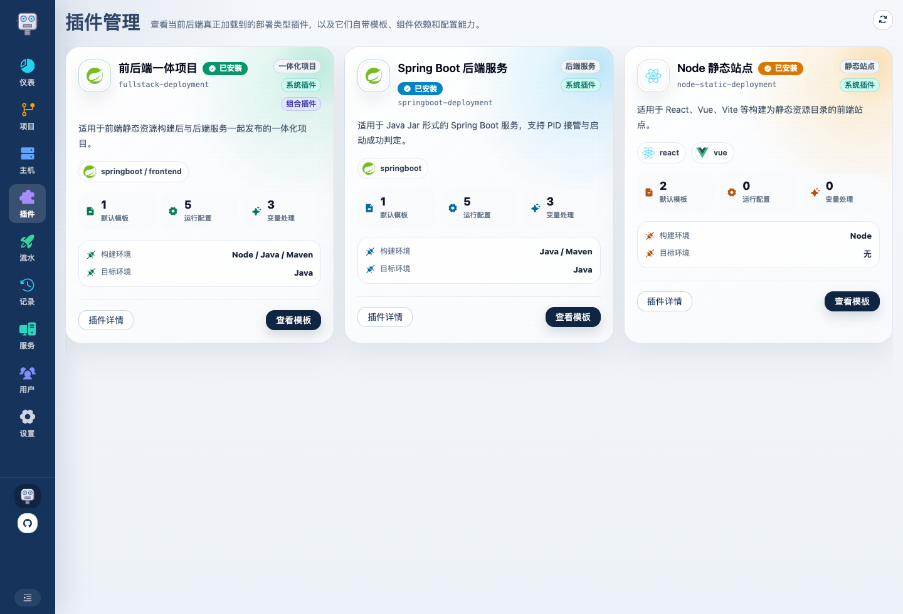
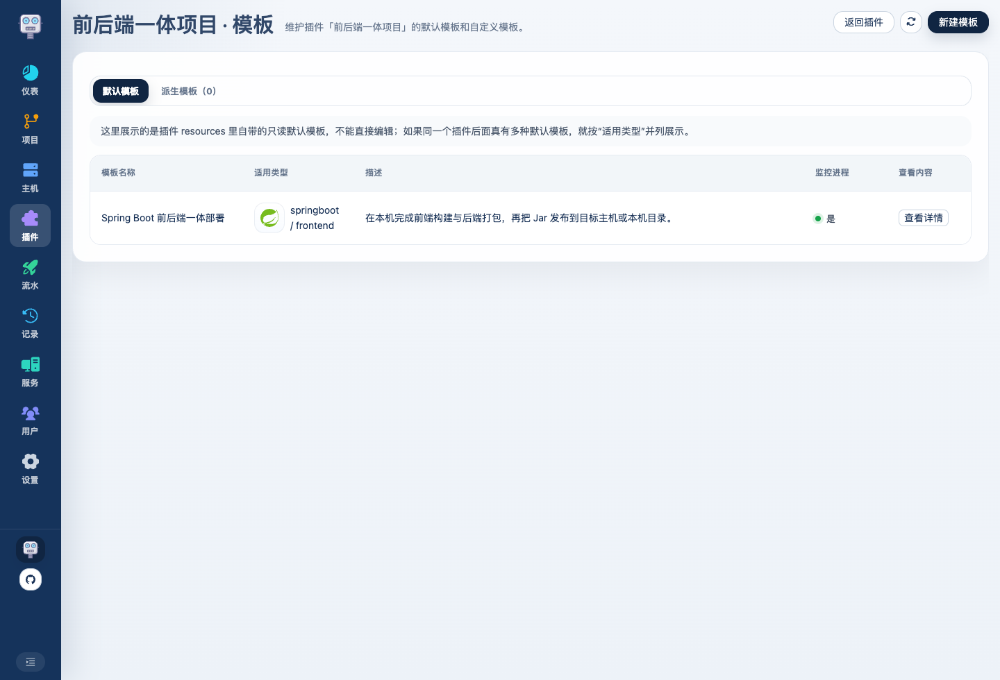
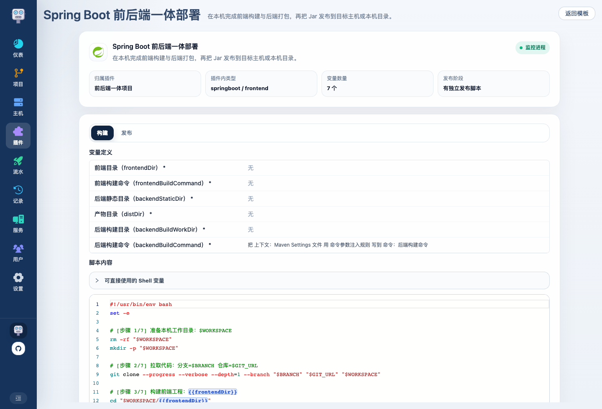

# Deploy Bot 使用介绍 06：插件和模板怎么设计

模板仍然是 Deploy Bot 的核心层。更准确的理解是：插件定义“部署类型能力”，模板定义“这个类型下的一套可复用脚本结构”。

## 1. 插件和模板分别负责什么

插件和模板入口长这样：

进入某个插件后，可以看到它的默认模板和自定义派生模板：

这里需要先区分两层：

- 插件：声明部署类型、运行时要求、运行配置表单、默认模板、变量、PID 发现和启动判定
- 模板：承载构建脚本、发布脚本和变量定义，可以来自插件内置，也可以由管理员派生自定义

如果你把项目看成代码源、把主机看成落点，那插件就是“部署类型”，模板就是“这类类型下的一套部署方法”。

## 2. 当前内置了哪些插件

当前内置插件主要有三类。它们不是简单的“模板分类”，而是把运行环境要求、流水线运行配置、默认模板、变量改写、进程监控和启动判定都收在一起。

### Spring Boot 后端服务

插件标识是 `springboot-deployment`，适合构建后产物是一个 Spring Boot Jar 的后端服务，例如普通接口服务、管理后台后端、定时任务服务等。

它提供的能力包括：

- 构建环境要求：本机构建阶段需要 `JAVA` 和 `MAVEN`
- 目标环境要求：发布目标主机需要 `JAVA`
- 默认模板：`Spring Boot Jar 部署`
- 默认构建命令：`mvn -U clean package -DskipTests`
- 发布方式：把构建出的 Jar 复制到目标部署目录，再由插件生成受管启动脚本
- 启动命令：插件固定生成 `java ... -jar 服务名.jar ...`，用户不用手写完整 `java -jar`
- 进程接管：内置 Java 进程发现能力，通过部署身份参数定位本次启动出来的进程
- 启动判定：支持用户填写启动关键字；如果没填，插件会尝试匹配 Spring Boot 常见的 `Started ... in ... seconds`

流水线里会出现的运行配置主要有：

- `JVM 参数`：放 `-Xms256m -Xmx512m` 这类 JVM 参数
- `系统属性`：放 `-Dfile.encoding=UTF-8`、`-Duser.timezone=Asia/Shanghai` 这类 `-D` 参数
- `Spring Profile`：填写后会生成 `--spring.profiles.active=xxx`
- `应用参数`：放 `--server.port=8080`、`--logging.level.xxx=debug` 这类 Jar 后面的 Spring Boot 参数
- `application.yml`：平台会在发布阶段写成目标主机上的配置文件，并自动注入 `--spring.config.additional-location=file:...`

Spring Boot 插件还会做一些变量改写：

- 如果流水线绑定了 Maven Settings，会把 settings 路径注入 Maven 构建命令
- 如果填写了 `Spring Profile` 或 `application.yml`，会生成 Spring Boot 启动参数
- 如果填写了 JVM 参数、系统属性、应用参数，会统一参与生成最终启动命令
- 插件会自动注入部署 ID、流水线 ID、项目 ID、服务名等应用参数，方便后续定位 PID 和排查历史部署

适合选它的情况：

- 仓库构建后能得到一个 Jar
- 运行方式本质是 Spring Boot / Java 后端服务
- 需要平台接管 PID、停止旧服务、观察启动日志
- 只是端口、Profile、JVM 参数、日志级别、application.yml 不同

不适合选它的情况：

- 产物不是 Jar，而是 Docker 镜像、Python 服务、Go 二进制等
- 启动和判活方式完全不是 Java 服务语义
- 需要编排多个独立服务，而不是一个受管进程

### Node 静态站点

插件标识是 `node-static-deployment`，适合 React、Vue、Vite 等最终构建成静态资源目录的前端站点。

它提供的能力包括：

- 构建环境要求：本机构建阶段需要 `NODE`
- 目标环境要求：不要求目标主机安装 Node，因为发布的是静态产物
- 默认模板：`React 静态站点部署`、`Vue 静态站点部署`
- 默认构建命令：`npm ci --cache "$BUILD_WORKSPACE_ROOT/caches/npm" --prefer-offline && npm run build`
- 发布方式：把构建后的静态产物目录同步到目标部署目录
- 进程监控：默认不开启，因为静态站点本身没有由 Deploy Bot 启动并接管的常驻进程

它的模板变量主要有：

- `构建命令`：比如 `npm install --no-audit --no-fund && npm run build`
- `产物目录`：比如 `dist`、`build`、`.output/public`

适合选它的情况：

- 前端项目最终输出一个静态目录
- 目标主机只需要接收文件，比如由 Nginx、Caddy 或其他已有 Web 服务托管
- 部署过程不需要启动新进程，也不需要 PID 接管

不适合选它的情况：

- 前端需要 `node server.js` 这类运行时服务
- 需要部署 Docker 镜像
- 前端只是后端 Jar 里的静态资源，需要和后端一起打包发布，这种更适合前后端一体插件

### 前后端一体项目

插件标识是 `fullstack-deployment`，适合同一个仓库里同时包含前端工程和 Spring Boot 后端工程，并且发布时希望前端静态资源进入后端 Jar 的项目。

它提供的能力包括：

- 构建环境要求：本机构建阶段需要 `NODE`、`JAVA`、`MAVEN`
- 目标环境要求：发布目标主机需要 `JAVA`
- 默认模板：`Spring Boot 前后端一体部署`
- 构建流程：先构建前端，再把前端静态产物同步到后端静态目录，然后执行后端 Maven 构建
- 发布流程：复用 Spring Boot 的 Jar 发布和受管启动能力
- 进程监控：默认开启，和 Spring Boot 插件一样支持 PID 接管和启动判定

它的模板变量主要有：

- `前端目录`：前端工程在仓库里的相对目录，例如 `frontend`
- `后端静态目录`：接收前端产物的后端静态资源目录，例如 `backend/src/main/resources/static`
- `后端构建目录`：执行 Maven 构建的后端目录，例如 `backend` 或 `.`
- `前端构建命令`：前端依赖安装和构建命令
- `后端构建命令`：Maven 构建命令

它还会复用 Spring Boot 插件的运行配置能力，所以流水线里仍然可以填写：

- `JVM 参数`
- `系统属性`
- `Spring Profile`
- `应用参数`
- `application.yml`

适合选它的情况：

- 一个仓库同时包含前端和 Spring Boot 后端
- 前端构建结果会进入后端静态目录
- 最终发布物仍然是一个后端 Jar
- 希望部署后由平台接管 Java 进程

不适合选它的情况：

- 前端和后端是两个独立发布物，应该拆成两条流水线
- 前端是独立静态站点，后端不需要重新打包
- 后端不是 Spring Boot Jar

### 三个内置插件怎么选

可以简单按最终发布物来判断：

| 场景 | 推荐插件 | 最终发布物 | 是否监控进程 |
| --- | --- | --- | --- |
| 普通 Spring Boot 后端 | Spring Boot 后端服务 | Jar | 是 |
| React / Vue 静态站点 | Node 静态站点 | 静态目录 | 否 |
| 前端打进 Spring Boot 后端 | 前后端一体项目 | Jar | 是 |

如果你的项目只是运行参数不同，优先继续使用内置插件和默认模板；如果最终发布物、启动方式、进程发现、判活方式都不同，再考虑新增插件。

## 3. 模板页主要看什么

模板页会展示插件模板暴露出来的完整信息：

- 基础信息：模板名称、说明、所属插件、是否监控进程
- 构建阶段：构建脚本、构建变量、可用 Shell 上下文变量
- 发布阶段：发布脚本、发布变量、可用 Shell 上下文变量
- 运行配置：插件暴露给流水线填写的字段

如果某个默认模板没有额外变量或配置，页面会用轻量提示展示。

模板详情页会按阶段展示脚本、变量定义、运行配置和可用 Shell 变量：

## 4. 插件默认模板和自定义模板怎么选

更推荐的原则是：

- 部署方式是普通 Spring Boot / 静态站点 / 前后端一体，优先选插件默认模板
- 部署目录、构建命令、运行参数、application.yml 这类差异，放流水线运行配置或变量里
- 只有脚本结构确实不同，才从默认模板派生自定义模板
- 如果部署类型本质不同，例如 Docker、Python、Go，适合新增插件承载对应能力

这样模板数量更容易控制，前端也只需要按插件表单渲染字段。

## 5. 运行配置不要等同于启动命令

Spring Boot 这类服务更适合填写运行配置，而不是手写完整启动命令：

- `java -jar` 对这个插件来说是固定语义
- Jar 名称、部署目录、日志路径、部署 ID、流水线 ID 都能从上下文拿到
- 真正需要用户改的是 JVM 参数、`-D` 系统属性、应用参数和 application.yml

这些内容统一放在插件运行配置里。插件拿到配置后生成最终启动脚本，部署详情里也会保存当次实际使用的运行配置。

## 6. 可用 Shell 变量从哪里来

模板脚本里可以使用平台和插件提供的上下文变量，例如：

- `DEPLOYMENT_ID`
- `PROJECT_NAME`
- `PIPELINE_NAME`
- `PIPELINE_TAGS`
- `SERVICE_NAME`
- `TARGET_DIR`
- `ARTIFACT_DIR`
- 插件生成的运行配置路径或启动脚本路径

这些变量由后端和插件 API 提供。模板查看页会高亮脚本里实际用到过的变量，方便确认脚本和上下文是否匹配。

## 7. 模板里最值得花时间打磨的是什么

如果只先抓最关键的部分，优先把这几件事打磨清楚：

- 构建脚本和发布脚本边界要清楚
- 变量命名要稳定
- 插件运行配置要表达“用户真正需要改的东西”
- 需要监控进程的模板要明确启动关键字和启动超时

模板整理好以后，就可以进入流水线配置，把项目、主机、环境、模板、变量和运行配置装配成一条可直接部署的流程。
