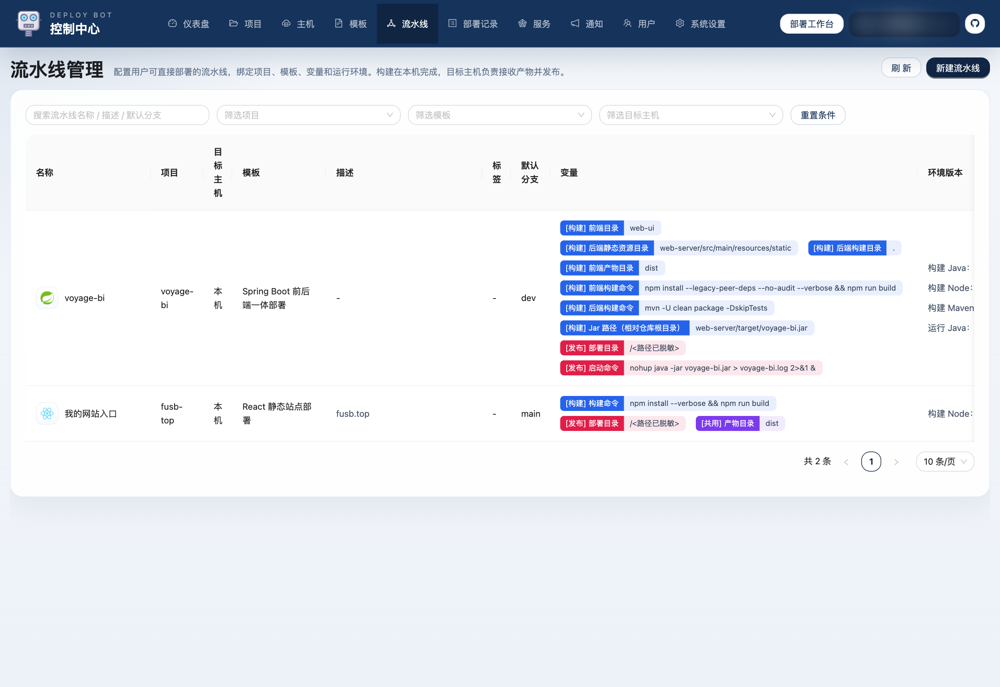
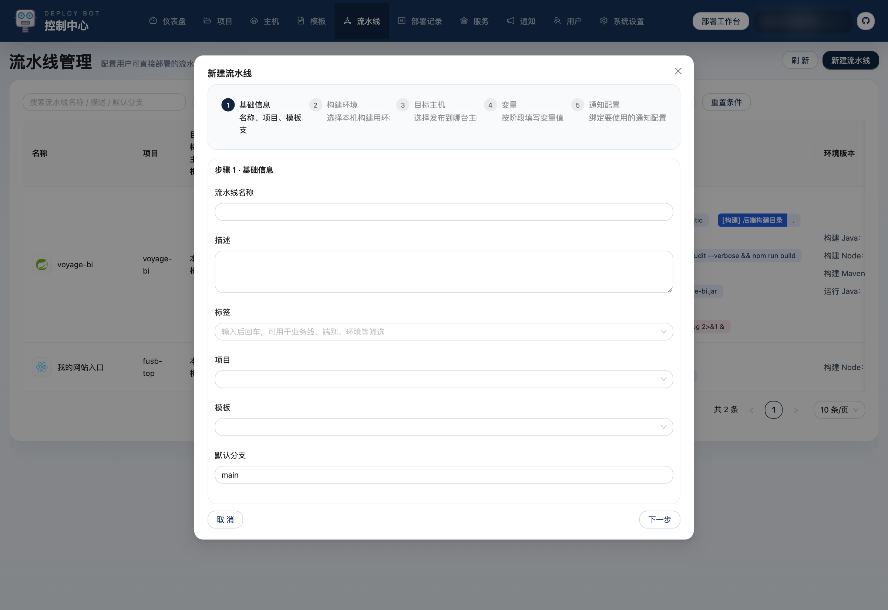

# Deploy Bot 使用介绍 07：流水线怎么拼出完整部署流程

如果说模板定义了“这一类项目怎么部署”，那流水线定义的就是“这个项目部署到这个环境时，具体应该怎么跑”。

这一篇会把整条部署链路真正串起来。

## 1. 流水线页在解决什么问题

流水线页是把这些资源真正装配起来的地方：

- 项目
- 模板
- 本机构建环境
- 目标主机
- 目标主机运行环境
- 变量默认值
- 通知配置

一条流水线配好之后，用户端就可以直接拿来发版。

## 2. 新建流水线的步骤结构

流水线编辑器本身是分步的：

从代码里可以看到，它通常按这个顺序展开：

1. 基础信息
2. 构建环境
3. 目标主机
4. 运行配置
5. 变量
6. 通知配置

其中第 4 步 `运行配置` 只在需要运行时配置的场景下出现。

## 3. 步骤 1：基础信息

基础信息里主要填：

- 流水线名称
- 描述
- 标签
- 项目
- 模板
- 默认分支

这一页的关键不是“填多少”，而是先把这条线绑定到正确的项目和模板上。  
后面的构建环境、变量结构，都会跟着模板变化。

### 标签推荐怎么用

标签比较适合表达这些维度：

- 阶段：测试环境 / 预发环境 / 生产环境
- 端别：前端 / 后端 / 一体
- 业务线：支付 / 管理台 / 官网

这样后面大厅和管理页筛选会更顺。

## 4. 步骤 2：构建环境

这一步决定本机拿什么环境做构建。

代码里已经写得很清楚：构建固定在本机完成，不会跟着目标主机切换。  
这里通常选择：

- 构建 Java 环境
- 构建 Node 环境
- 构建 Maven 环境
- 构建 Maven settings

### 为什么 Maven settings 放在这里

因为它只影响构建，不影响运行。  
如果你的构建依赖私服，就应该在这里把对应的 settings.xml 选上。

## 5. 步骤 3：目标主机

这一页决定产物发到哪里：

- 目标主机
- 目标主机运行 Java 环境
- 应用名
- 启动关键字
- 启动超时时间

如果模板开启了进程监控，应用名和启动关键字就会非常关键。

### 应用名是干什么的

它不是单纯的展示字段。  
系统会把应用名当成内置变量注入模板，后面很多产物名、启动命令、日志文件名都会围绕它生成。

### 启动关键字怎么理解

它只用于判断“服务是不是真的启动成功了”。  
所以这里应该填应用启动完成时日志里稳定会出现的一句标志性内容。

## 6. 步骤 4：运行配置

如果这条流水线属于需要运行参数的服务型模板，这一步会出现。

这里主要填两类东西：

- `springProfile`
- `runtimeConfigYaml`

平台会把这份 YAML 在发布阶段写入目标主机，并自动附加到启动参数里。  
所以如果你只是想覆盖少量配置，不一定要改模板，直接在流水线这一层填 YAML 就够了。

## 7. 步骤 5：变量

这是流水线最关键的一步之一。

模板里暴露出来的变量，到这里都需要落成“这条流水线自己的默认值”。

这些变量会按阶段分组显示：

- 构建变量
- 发布变量
- 共用变量

### 这里一般填什么

取决于模板，但最常见的是：

- 部署目录
- 构建目录
- 构建命令
- 产物目录
- 启动命令
- 前端目录 / 后端目录
- Jar 路径

## 8. 步骤 6：通知配置

如果你已经在通知管理里建好了通知配置，这里就可以直接绑定：

- 选择这条流水线要用哪些通知配置

通知的触发时机不在流水线这一步重复单独定义，而是跟随通知配置本身的通知类型走。

## 9. 默认模板一般怎么配成流水线

这是最容易帮助理解的一部分。

### Spring Boot Jar 部署

通常适合：

- 单后端服务

流水线里一般会这样配：

- 模板：`Spring Boot Jar 部署`
- 构建 Java：选择本机 JDK
- 构建 Maven：选择本机 Maven
- 目标主机运行 Java：选择目标主机 JDK
- 变量：
  - `buildWorkDir`：如果是普通项目，常填 `.`
  - `buildCommand`：`mvn -U clean package -DskipTests`
  - `jarPath`：例如 `target/xxx.jar`
  - `targetDir`：目标机器上的部署目录
  - `startCommand`：例如 `nohup java -jar xxx.jar > xxx.log 2>&1 &`

### React / Vue 静态站点部署

通常适合：

- 纯前端站点

流水线里一般会这样配：

- 模板：`React 静态站点部署` 或 `Vue 静态站点部署`
- 构建 Node：选择本机 Node
- 变量：
  - `buildCommand`：前端构建命令
  - `distDir`：前端产物目录
  - `targetDir`：静态站点发布目录

这类模板不需要运行 Java，也不需要启动关键字。

### Spring Boot 前后端一体部署

通常适合：

- 前端和后端在同仓库
- 前端构建结果要复制到后端静态目录

流水线里一般会这样配：

- 模板：`Spring Boot 前后端一体部署`
- 构建 Node：本机 Node
- 构建 Maven：本机 Maven
- 构建 Java：本机 JDK
- 目标主机运行 Java：目标机 JDK
- 变量：
  - `frontendDir`
  - `backendStaticDir`
  - `backendBuildWorkDir`
  - `distDir`
  - `frontendBuildCommand`
  - `backendBuildCommand`
  - `jarPath`
  - `targetDir`
  - `startCommand`

## 10. 模板和流水线的边界怎么把握

记一个很实用的原则：

- 这类项目都一样的东西，放模板
- 这条线自己才知道的东西，放流水线

比如：

- `mvn clean package` 这种通用逻辑，放模板
- `/home/admin/apps/xxx` 这种环境落点，放流水线

如果把边界放对，后面你维护起来会很轻松。  
如果边界放反，就会出现模板过多或流水线复制泛滥。

流水线配置完成后，就可以回到用户端发起部署，并结合部署记录和详情页排查问题。
