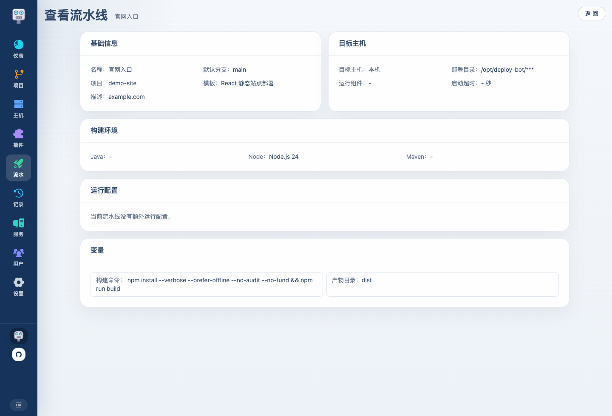

# Deploy Bot 使用介绍 07：流水线怎么拼出完整部署流程

如果说插件和模板定义了“这一类项目怎么部署”，那流水线定义的就是“这个项目部署到这个环境时，具体应该怎么跑”。

这一篇会把整条部署链路真正串起来。

## 1. 流水线页在解决什么问题

流水线页是把这些资源真正装配起来的地方：

- 项目
- 插件模板
- 本机构建环境
- 目标主机
- 目标主机运行环境
- 插件运行配置
- 模板变量默认值
- 标签和重要标签
- 通知配置

一条流水线配好之后，用户就可以直接在流水线大厅发版。

## 2. 新建流水线的步骤结构

流水线编辑器使用单独页面承载完整配置：

通常按这个顺序展开：

1. 基础信息
2. 构建环境
3. 目标主机
4. 运行配置
5. 变量
6. 通知配置

其中 `运行配置` 会根据插件表单动态出现。不同插件可以提供不同字段，页面会按插件返回的结构展示。

保存后的流水线也可以进入查看页，集中确认项目、模板、目标主机、运行配置、变量和通知绑定：

## 3. 步骤 1：基础信息

基础信息里主要填：

- 流水线名称
- 描述
- 标签
- 重要标签
- 项目
- 模板
- 默认分支

这一页的关键不是“填多少”，而是先把这条线绑定到正确的项目和模板上。后面的构建环境、运行配置、变量结构，都会跟着插件模板变化。

### 标签和重要标签怎么用

普通标签适合做筛选，例如：

- 阶段：测试环境 / 预发环境 / 生产环境
- 端别：前端 / 后端 / 一体
- 业务线：支付 / 管理台 / 官网

重要标签最多两个，用来放最需要一眼区分的信息，例如 `PRE`、`TEST`、`腾讯云`。它会显示在流水线名称前面，也会同步出现在部署记录、服务管理和详情里。

这样流水线名称可以保持简洁，环境和机房等信息交给标签表达。

## 4. 步骤 2：构建环境

这一步决定本机拿什么环境做构建。

构建固定在部署平台本机完成，目标主机负责接收产物和执行发布。这里通常选择：

- 构建 Java 环境
- 构建 Node 环境
- 构建 Maven 环境
- 构建 Maven settings

如果某个环境类型只有一个可选项，页面会自动选上，减少重复填写。

### 为什么 Maven settings 放在这里

因为它只影响构建，不影响运行。  
如果你的构建依赖私服，就应该在这里把对应的 settings.xml 选上。平台构建时会自动给 Maven 注入对应配置。

## 5. 步骤 3：目标主机

这一页决定产物发到哪里：

- 目标主机
- 部署目录
- 目标主机运行组件
- 启动关键字
- 启动超时时间

如果插件模板开启了进程监控，启动关键字和启动超时会显示出来。

### 启动关键字怎么理解

它只用于判断“服务是不是真的启动成功了”。  
所以这里应该填应用启动完成时日志里稳定会出现的一句标志性内容。

对于 Spring Boot，如果没有填写关键字，插件会默认尝试匹配 `Started ... in ... seconds`。

## 6. 步骤 4：运行配置

运行配置由插件决定，流水线编辑页会按插件表单展示对应字段。

以 Spring Boot 插件为例，这里常见的是：

- JVM 参数
- `-D` 系统属性
- 应用参数
- `application.yml`

平台会在发布阶段把 `application.yml` 写入目标主机，并把路径注入启动参数。插件会根据上下文生成最终启动脚本。

对于 Node 静态站点，这一步可能就没有额外运行配置。

## 7. 步骤 5：变量

模板里暴露出来的变量，到这里都需要落成“这条流水线自己的默认值”。

这些变量会按阶段分组显示：

- 构建变量
- 发布变量
- 共用变量

### 这里一般填什么

取决于模板和插件，但最常见的是：

- 构建目录
- 构建命令
- 产物目录
- 前端目录 / 后端目录
- 静态资源目录

部署目录、服务名、运行配置路径这类平台上下文，优先由流水线字段和插件上下文生成，不建议重复塞到普通变量里。

## 8. 步骤 6：通知配置

如果你已经在系统设置里建好了通知配置，这里就可以直接绑定：

- 选择这条流水线要用哪些通知配置

通知的触发时机不在流水线这一步重复单独定义，而是跟随通知配置本身的通知类型走。

## 9. 流水线锁定

管理员可以锁定流水线，也可以批量锁定多条流水线。

锁定时可以填写：

- 锁定原因
- 锁定开始时间
- 锁定结束时间

用户点击部署时，如果流水线处于锁定时间段内，会先看到锁定原因和时间范围，而不是等到选完分支之后才发现不能部署。过了结束时间后，系统会自动忽略过期锁定。

## 10. 默认模板一般怎么配成流水线

### Spring Boot Jar 部署

通常适合单后端服务：

- 模板：`Spring Boot Jar 部署`
- 构建 Java：选择本机 JDK
- 构建 Maven：选择本机 Maven
- 目标主机运行 Java：选择目标机 JDK
- 运行配置：JVM 参数、系统属性、应用参数、application.yml
- 变量：构建命令、Jar 路径等模板变量

### React / Vue 静态站点部署

通常适合纯前端站点：

- 模板：`React 静态站点部署` 或 `Vue 静态站点部署`
- 构建 Node：选择本机 Node
- 变量：构建命令、dist 目录、静态站点发布目录

这类模板通常只关注静态产物发布。

### Spring Boot 前后端一体部署

通常适合前端和后端在同仓库：

- 模板：`Spring Boot 前后端一体部署`
- 构建 Node：本机 Node
- 构建 Maven：本机 Maven
- 构建 Java：本机 JDK
- 目标主机运行 Java：目标机 JDK
- 运行配置：Spring Boot 运行配置
- 变量：前端目录、后端目录、构建命令、dist 目录等

## 11. 模板和流水线的边界怎么把握

记一个很实用的原则：

- 这类项目都一样的东西，放插件或模板
- 这条线自己才知道的东西，放流水线

比如：

- `java -jar` 这种 Spring Boot 插件固定语义，放插件
- `mvn clean package` 这种模板默认构建逻辑，放模板
- `/home/admin/apps/xxx` 这种环境落点，放流水线
- `--server.port=8081` 这种应用参数，放运行配置

如果把边界放对，后面维护起来会轻很多。  
如果边界放反，就会出现模板过多、流水线复制泛滥，或者部署类型扩展困难。

流水线配置完成后，就可以回到流水线大厅发起部署，并结合部署记录和详情页排查问题。
