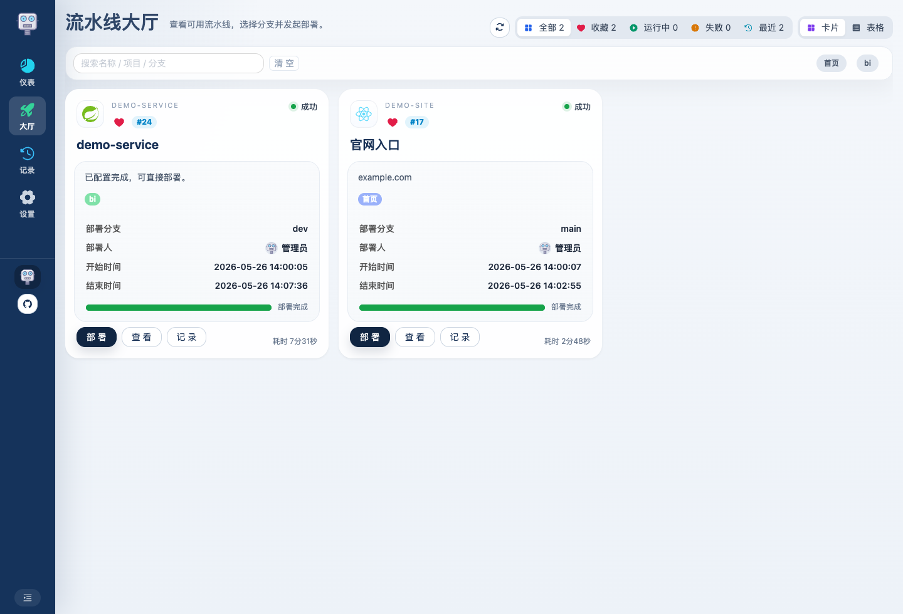
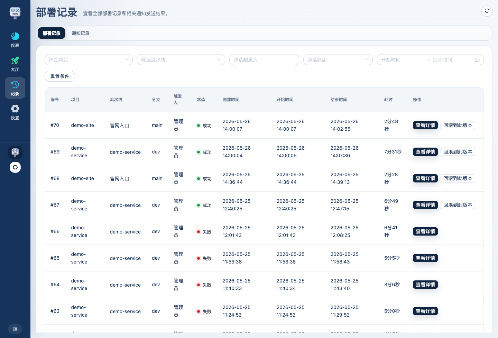
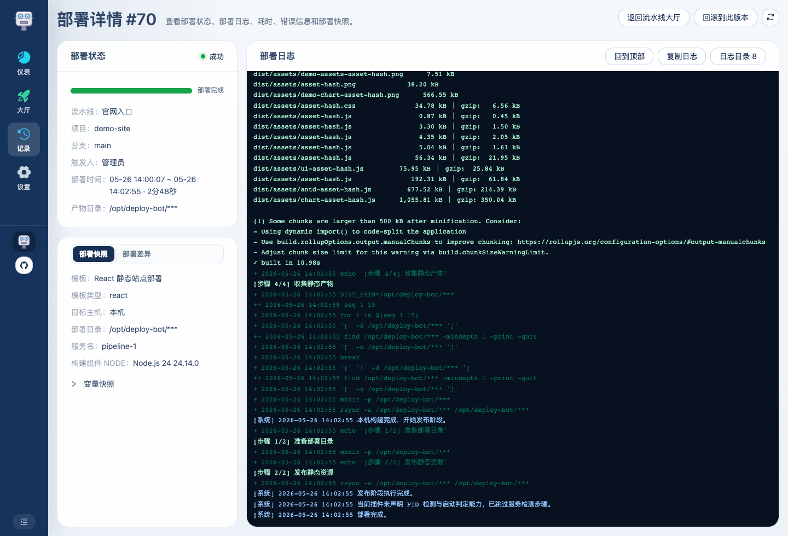
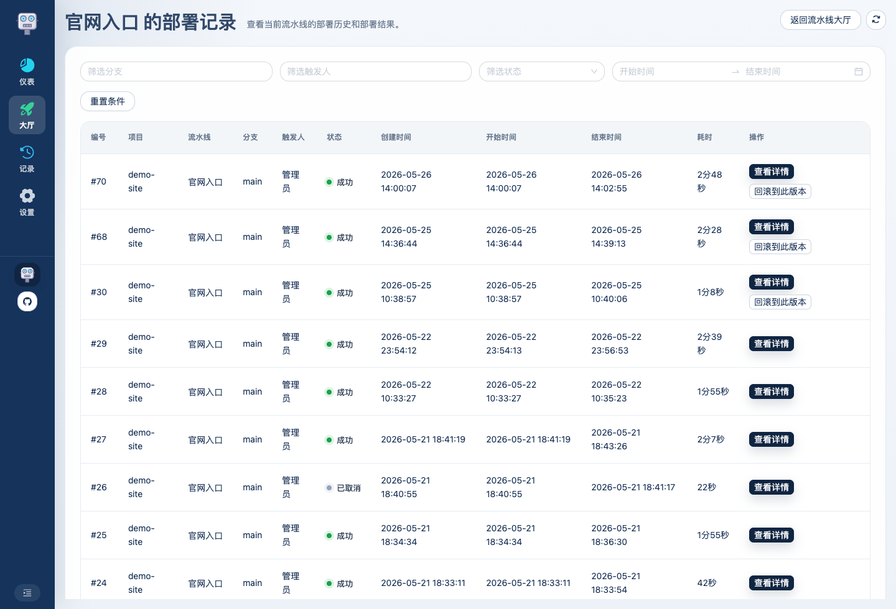

# Deploy Bot 使用介绍 08：怎么发起部署、查看记录与详情

到这一步，前面的配置链路已经齐了。  
这一篇只看用户真正怎么用它发版、回看历史和排查问题。

## 1. 流水线大厅是发版入口

真正最常用的页面是流水线大厅：

这页通常会做几件事：

- 找到目标流水线
- 按关键词和标签筛选
- 收藏常用流水线
- 在卡片 / 表格模式之间切换
- 触发部署
- 看当前状态和进度
- 进入记录、历史或详情

如果你是日常发版的人，这一页基本就是首页。

## 2. 发起部署前一般关注什么

触发部署前，通常会先看：

- 当前是不是要发正确的那条流水线
- 重要标签是不是对应环境
- 分支是不是对的
- 最近一次部署是不是刚失败过
- 运行中的服务是不是还正常
- 流水线是否被管理员锁定

如果流水线被锁定，点击部署时会直接展示锁定原因和时间段。

## 3. 部署记录页适合看什么

每次执行后，都会进入部署记录：

这个页面更适合做全局回看，例如：

- 今天发了哪几次
- 哪几次成功、失败或已取消
- 某条线是不是反复失败
- 哪次可以直接重新发布历史产物
- 通知记录有没有发送成功

通知记录并入部署记录，通过 tab 切换查看。

## 4. 详情页才是排查核心

真正出了问题，还是要进部署详情：

这页会同时给你几类信息：

- 当前执行状态和进度
- SSE 实时日志
- 日志目录
- 时间信息和耗时
- 部署快照
- 部署差异

### 日志为什么更适合排查了

部署日志通过 SSE 增量刷新。部署过程中可以：

- 暂停自动滚动，方便回看前面的日志
- 恢复滚动，继续跟到最新输出
- 回到顶部 / 回到底部
- 复制完整日志
- 打开日志目录快速跳到步骤或关键错误

部署进入终态后，日志流会继续收尾一小段时间，用于展示进程退出前后的关键输出。

日志目录会优先聚合部署步骤和关键错误，帮助你在长日志里快速回到关键位置。

## 5. 部署快照和部署差异分别看什么

详情页里的排查信息拆成两个 tab：

### 部署快照

快照会把那次部署真正使用的上下文固化下来，包括：

- 流水线变量
- 插件运行配置
- 构建环境
- 目标运行环境
- 目标目录
- 服务相关上下文

快照适合用来回看环境、变量、application.yml、启动参数等部署上下文。

### 部署差异

部署差异会异步生成，不阻塞主部署流程。它主要用于回答：

- 这次相对上一次成功部署，多了哪些 commit
- 谁提交了这些 commit
- 文件层面改了什么
- 当前部署实际构建出的 commit 是哪个

这对“为什么这次坏了”很有帮助，尤其是多人协作或连续发布时。

## 6. 流水线历史和部署记录有什么区别

如果你只想看某一条线，就进流水线历史：

它和全局部署记录的区别是：

- `部署记录`：所有流水线混在一起看
- `流水线历史`：只看这一条线自己的连续变化

这对排查“同一条线从哪次开始坏掉”特别有帮助。

## 7. 重新发布应该怎么理解

当前平台里的“回滚到此版本”会：

- 基于历史成功产物
- 再创建一条新的部署记录
- 把那份历史产物重新发布出去

这个动作基于历史产物重新发布，适合快速恢复到上一个稳定版本。

## 8. 推荐的实际使用顺序

日常使用时，比较顺手的方式通常是：

1. 先从流水线大厅触发部署
2. 需要盯进度就直接进部署详情
3. 发布完以后回到部署记录看整体结果和通知结果
4. 如果某条线连续有问题，再进流水线历史做连续对比
5. 如果这次和上次成功之间差异较大，再看部署差异定位变更范围

到这里，部署主链路就完整了。后面再配合服务管理和系统设置，就能把整套使用链路补齐。
