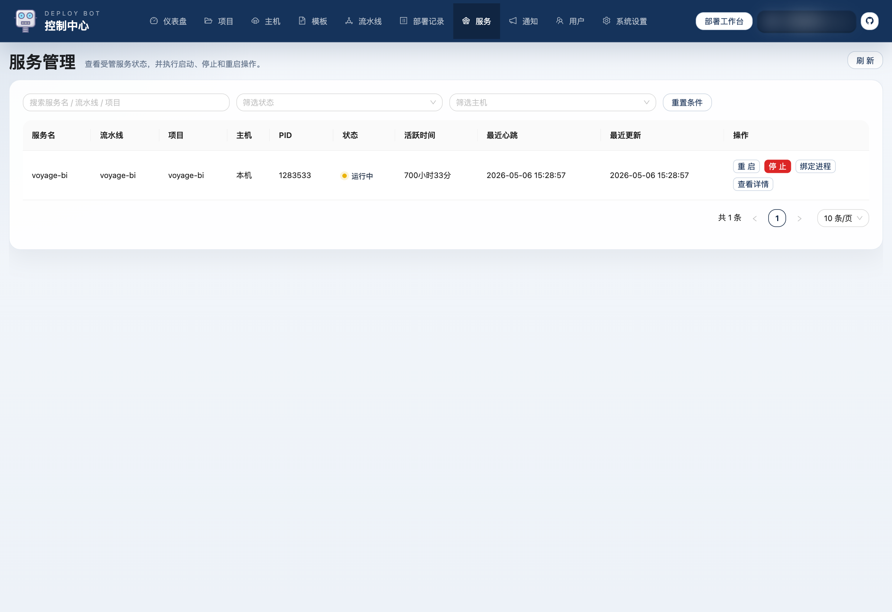
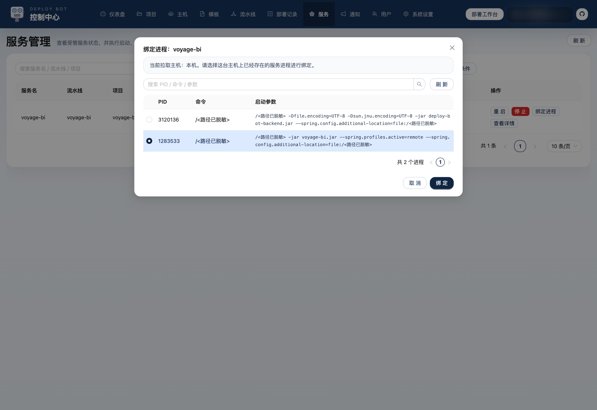
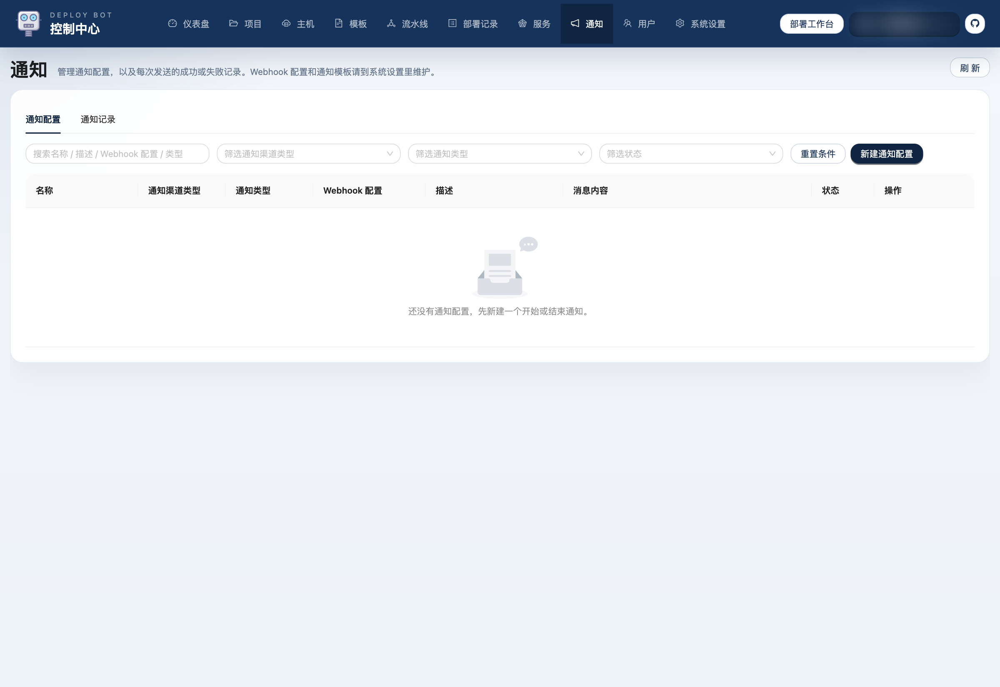
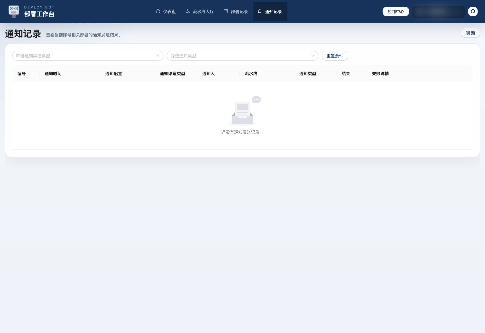
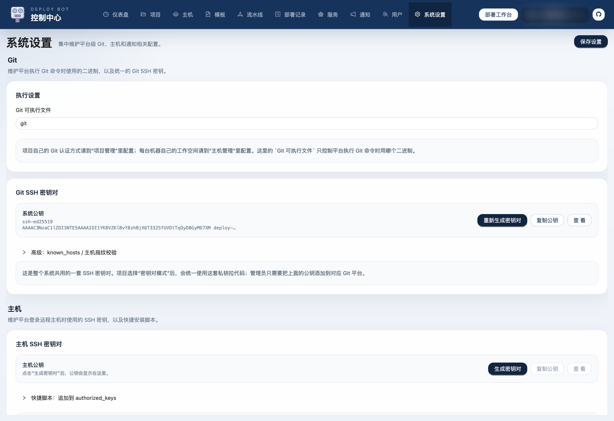
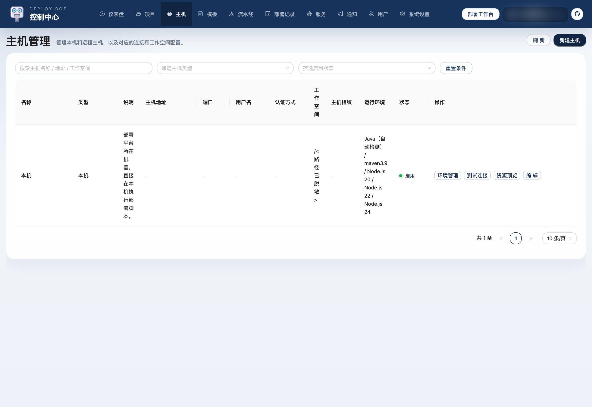
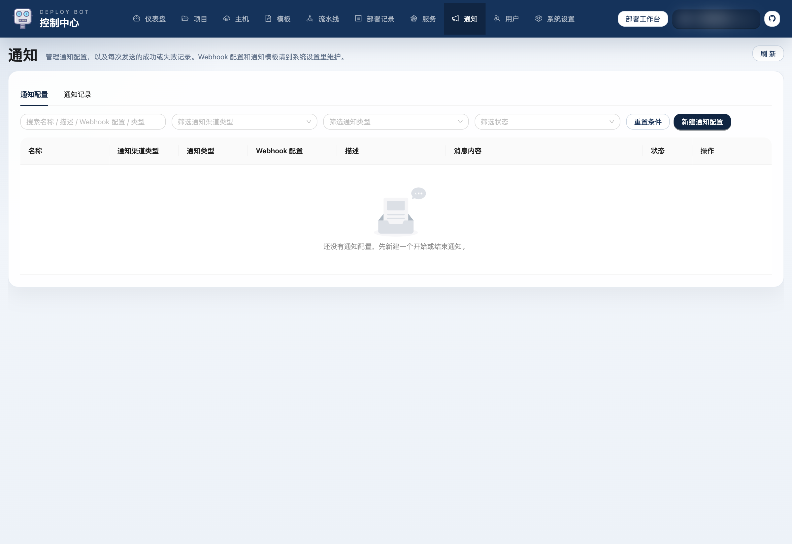

# Deploy Bot 使用介绍 09：服务、通知与系统设置怎么用

前面 8 篇已经把主链路讲完了，这一篇把后续运维时常用的三块补齐：

- 服务管理
- 通知
- 系统设置

## 1. 服务管理

服务页解决的是“部署完成以后，服务现在还活着吗”。

这里最值得关注的是：

- 当前状态
- 当前 PID
- 最近心跳
- 目标主机

如果模板开启了进程监控，平台在部署后就会尝试接管这个服务。

## 2. 手动绑定进程是为了解什么

有些服务并不是第一次就通过 Deploy Bot 拉起来的。  
这时如果平台不知道它的 PID，后面做重启或停止就容易失控。

这就是“绑定进程”存在的意义：

它会从目标主机拉进程列表出来让你选，而不是手填 PID。  
这样后续平台就能把这个服务纳入统一管理。

## 3. 通知页怎么理解

通知页更像是“通知配置和通知结果”的总入口：

这里主要看两件事：

- 哪些通知配置已经建好
- 每次通知有没有发成功

如果你接了飞书机器人或其他 Webhook，这一页就是后面排查是否推送成功的地方。

## 4. 用户端为什么也有通知记录

因为普通用户也需要知道自己的部署通知有没有发出：

这样就不用每次都切到管理端才能看通知结果。

## 5. 系统设置页的作用

系统设置不是日常高频页，但它负责平台级配置：

### Git 相关

### 主机 SSH 相关

### 通知相关

如果你要继续往通知里配 Webhook，还会进入更细的页签：

## 6. 哪些能力属于“日常高频”，哪些属于“平台维护”

可以简单这样区分：

### 日常高频

- 流水线大厅
- 部署记录
- 部署详情
- 服务状态

### 平台维护

- 项目
- 主机
- 运行环境
- 模板
- 系统设置
- 通知底层配置

这么分以后，整套系统看起来就不会乱。

## 7. 整条使用路径回顾

如果把 8 篇文章串起来，Deploy Bot 的一条完整使用路径就是：

1. 登录系统，理解管理端和用户端
2. 新建项目
3. 配主机
4. 配运行环境
5. 设计模板
6. 用流水线把它们组装成真正可部署流程
7. 在用户端触发部署、看历史、看详情
8. 用服务、通知和系统设置补齐后续运维动作

到这里，这套轻量部署平台的核心使用方式就完整了。
