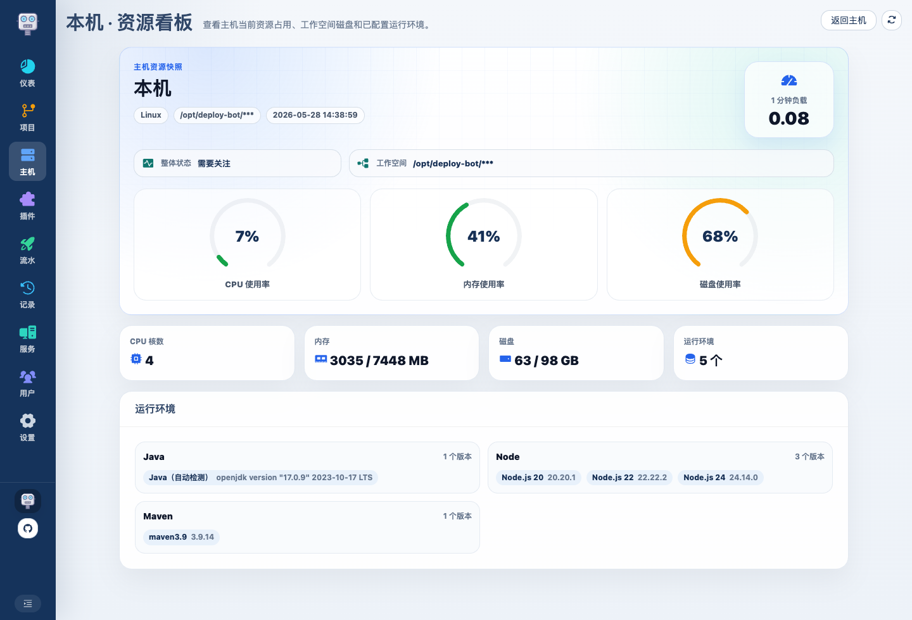

# Deploy Bot 使用介绍 09：服务、通知与系统设置怎么用

前面 8 篇已经把主链路讲完了，这一篇把后续运维时常用的几块补齐：

- 服务管理
- 主机资源
- 通知记录与通知设置
- 系统设置

## 1. 服务管理

服务页解决的是“部署完成以后，服务现在还活着吗”。

这里最值得关注的是：

- 当前状态
- 当前 PID
- 最近心跳
- 目标主机
- 关联流水线
- PID 变化轨迹

如果插件模板开启了进程监控，平台在部署后就会尝试接管这个服务。

## 2. 服务启停和高危操作

服务管理里可以对已接管服务做操作：

- 查看详情
- 启动
- 停止
- 重启
- 查看 PID 轨迹
- 手动绑定进程

停止、启动、重启这类高影响操作会收在更多菜单里。普通用户停止其他人的部署或服务时，也会记录停止人和原因，便于回溯。

## 3. 手动绑定进程是为了解什么

有些服务可能已经在目标主机上运行，需要先纳入 Deploy Bot 管理。  
绑定进程后，平台就能继续提供重启、停止和轨迹查看能力。

绑定进程入口如下：

它会从目标主机拉进程列表出来让你选择。  
这样后续平台就能把这个服务纳入统一管理。

## 4. 主机资源怎么看

主机管理里可以进入资源预览页，用来查看目标主机的资源状态：

- CPU
- 内存
- 磁盘
- 负载
- 最近采集时间

资源页会用结构化方式展示主机状态。管理员也可以在仪表盘的资源 tab 里看整体主机资源情况。

## 5. 通知现在怎么理解

通知相关信息按用途拆分：

- 系统设置：维护 Webhook 配置、通知模板、通知配置
- 部署记录：通过 tab 查看部署记录和通知记录
- 流水线：只绑定要使用的通知配置

这样“通知配置”和“通知结果”会落在各自更合适的位置。

当前已支持飞书自定义机器人通知。通知配置会绑定：

- 通知渠道类型
- 通知类型
- Webhook 配置
- 通知模板

通知记录会保存每次发送的成功 / 失败状态，以及失败原因或响应信息。

## 6. 系统设置页的作用

系统设置不是日常高频页，但它负责平台级配置。

### UI 设置

普通用户也能看到 UI 设置，包括：

- 浅色 / 深色 / 跟随系统
- 夜间自动深色
- 菜单布局
- 左侧菜单折叠
- 图标样式

浅色和深色会影响页面背景、表格、卡片、标签、弹窗和日志查看器等主要组件。跟随系统适合日常使用，夜间自动深色适合长时间查看部署日志或在弱光环境排查问题。

### Git 相关

这里维护平台访问 Git 仓库使用的 SSH 密钥对。

### 主机 SSH 相关

这里维护平台登录目标主机使用的 SSH 密钥对，以及快捷安装公钥脚本。

### 通知相关

如果你要继续往通知里配 Webhook，还会进入更细的页签：

### 清理设置

系统设置还会维护自动清理策略，例如历史构建产物、远程 artifacts、日志等。

## 7. 哪些能力属于“日常高频”，哪些属于“平台维护”

可以简单这样区分：

### 日常高频

- 流水线大厅
- 部署记录
- 部署详情
- 服务状态

### 平台维护

- 项目
- 主机
- 运行环境
- 插件
- 模板
- 流水线管理
- 系统设置
- 通知底层配置

按这个分工使用，日常部署和平台维护会更清楚。

## 8. 整条使用路径回顾

如果把 9 篇文章串起来，Deploy Bot 的一条完整使用路径就是：

1. 登录系统，理解菜单、主题和权限
2. 新建项目
3. 配主机
4. 配运行环境
5. 理解插件和模板
6. 用流水线把它们组装成真正可部署流程
7. 在流水线大厅触发部署、看历史、看详情
8. 用服务管理、通知记录和系统设置补齐后续运维动作

到这里，这套轻量部署平台的核心使用方式就完整了。
